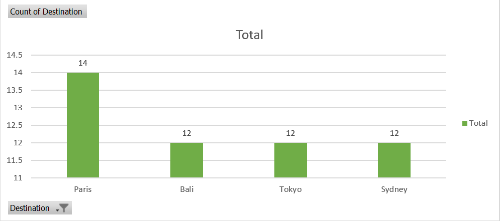
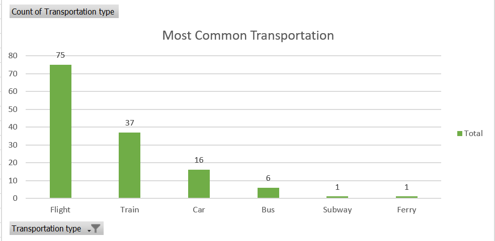
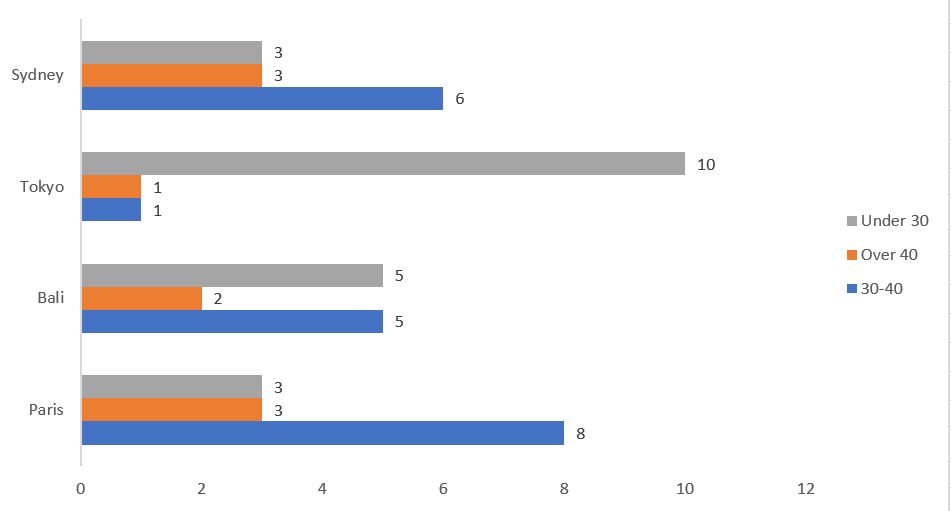
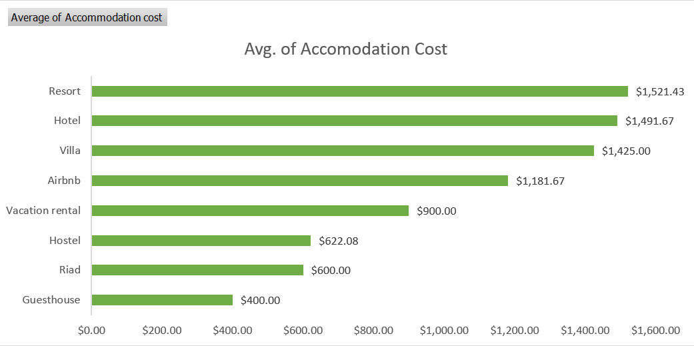
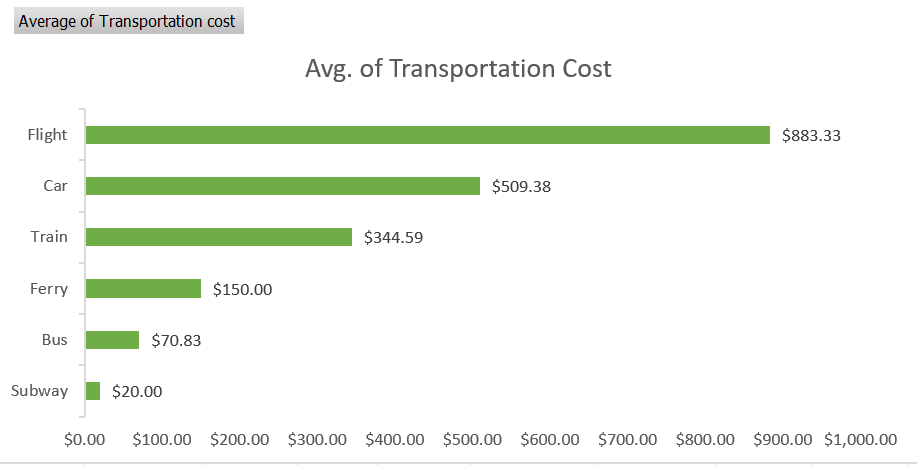

# Travel_dataset
This project analyzes a sample travel dataset using Microsoft Excel, focusing on data cleaning, exploratory analysis, segmentation, cost analysis, and visualization. The dataset contains information about 140 trips, including destinations, dates, traveler details, accommodation types, transportation modes, and associated costs.

# Data Cleaning
As my first step, I will do data cleaning such as
- Remove duplicates if any
- Fixed date format
- Check for blanks and replace it with N/A
---
# 1. Data Check Quality
- Missing values in Trip ID 72 and 128 replaced with N/A.
- Every trip has both a start date and end date which indicates no logical errors in data ranges.
- All cost values are numeric and in US Dollars.
---
# 2. Exploratory Analysis Summary

| Metric | Value |
|--------|-------|
|**Total Trips** | 139 |
|**Avg. Duration (days)** | 8 |
|**Avg. Accomodation Cost** | $1330.00 |
|**Avg. Tranportation Cost** | $672.57 |

**Top Destinations**
| City | Trips|
|------|------|
|**Paris** | 14 |
|**Bali** | 12 |
|**Sydney** | 12 |
|**Tokyo** | 12 |

**Summary**
Paris stands out as the top destination in this dataset.

**Most Common Tranport Type**
|Tranport Type | Trips |
|--------------|-------|
|**Flight** | 75 |
|**Train** | 37 |
|**Car** | 16 |

Summary
- Travelling by flight is the most used transportation compare to other types with 75 trips in total.
- Train comes in second with 37 trips only.
---
## 3. Segmentation
Top Destination based on Gender and Age Group
|**Destination**|**Age Group**|**Male Trips**|**Female Trips**|
|---------------|-------------|--------------|----------------|
|**Paris**|Under 30|1|2|
|         |30-40|4|4|
|         |Over 40|3|0|
|**Sydney**|Under 30|1|2|
|          |30-40|3|3|
|          |Over 40|3|0|
|**Bali**|Under 30|2|3|
|        |30-40|1|4|
|        |Over 40|1|1|
|**Tokyo**|Under 30|4|6|
|         |30-40|0|1|
|         |Over 40|1|0|

**Summary**
- Paris is the most popular destination for 30-40 age group, with an equal split male and female.
- Tokyo attracts more young female travellers.
- Female with over 40 do not really travel to top destination.
---

## 4. Cost Analysis

### a. Accomodation Cost Comparison
|**Accomodation Type**|**Avg. of Accomodation Cost**|
|---------------------|-----------------------------|
|**Resort**|$1521.43|
|**Hotel**|$1491.47|
|**Villa**|$1425.00|
|**Airbnb**|$1181.67|
|**Vacation Rental**|$900.00|
|**Hostel**|$622.08|
|**Riad**|$600.00|
|**Guesthouse**|$400.00|

**Summary**

Guesthouse is the cheapest accomodation option for all travellers whilst resort would cost the most, followed closely by hotel and villa.

### b. Transportation Cost Comparison
|**Transportation Type**|**Avg. of Transportation Cost**|
|-----------------------|-------------------------------|
|**Flight**|$883.33|
|**Car**|$509.38|
|**Train**|$344.59|
|**Ferry**|$150.00|
|**Bus**|$70.83|
|**Subway**|$20.00|

**Summary**

Flight is the most expensive transportation option for travelers, with car travel as the second most costly. The cost difference between flight and car is substantial.

### c. Relationship Analysis

